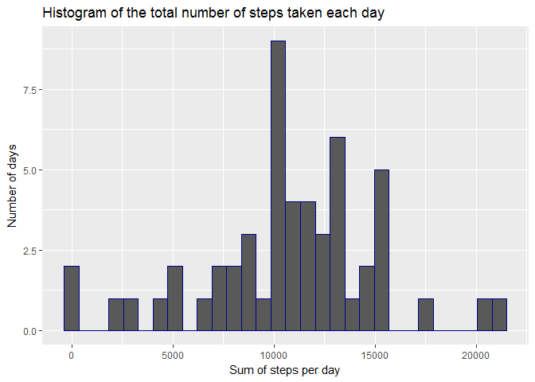
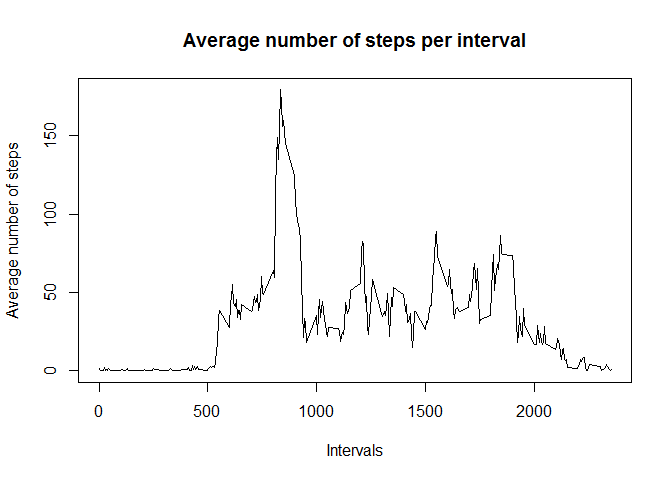
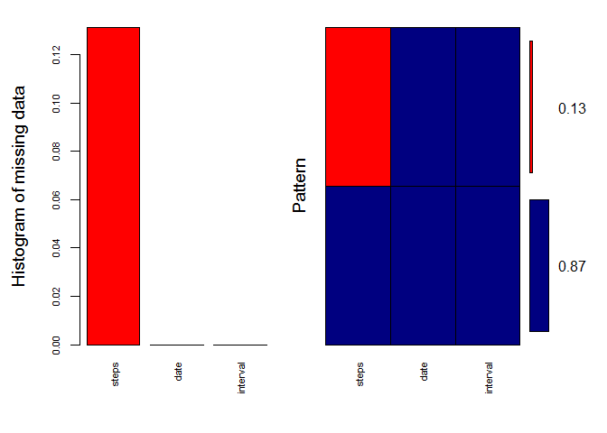
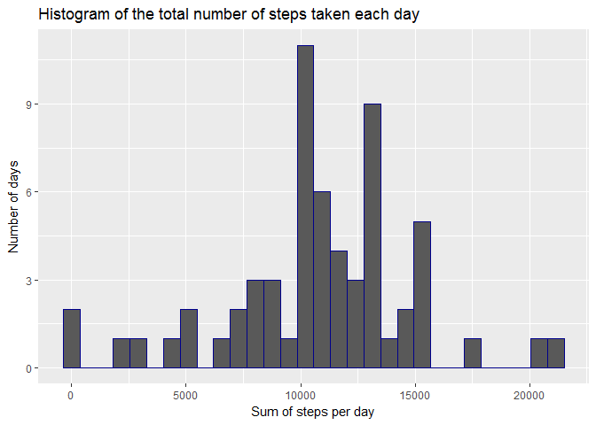
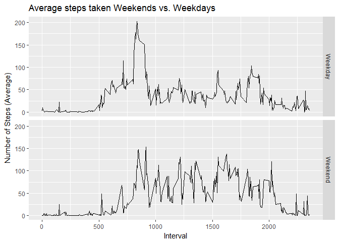

## Loading and preprocessing the data

The data was downloaded using the following code 

```r
activity_data <- read.csv("C://Users/Tamir/Documents/data/activity.csv")
```
This meet the requirement in the guidelines to include:
1.**Code for reading in the dataset and/or processing the data**
The dataset was tenatatively observed using the following steps.

* First, its class was checked using R command class()

```r
class(activity_data)
```

```
## [1] "data.frame"
```

* Second, its structure was checked using R command str()

```r
str(activity_data)
```

```
## 'data.frame':	17568 obs. of  3 variables:
##  $ steps   : int  NA NA NA NA NA NA NA NA NA NA ...
##  $ date    : Factor w/ 61 levels "2012-10-01","2012-10-02",..: 1 1 1 1 1 1 1 1 1 1 ...
##  $ interval: int  0 5 10 15 20 25 30 35 40 45 ...
```

* Third, descriptive statistics of the dataset were obtained using R command summary()

```r
summary(activity_data)
```

```
##      steps                date          interval     
##  Min.   :  0.00   2012-10-01:  288   Min.   :   0.0  
##  1st Qu.:  0.00   2012-10-02:  288   1st Qu.: 588.8  
##  Median :  0.00   2012-10-03:  288   Median :1177.5  
##  Mean   : 37.38   2012-10-04:  288   Mean   :1177.5  
##  3rd Qu.: 12.00   2012-10-05:  288   3rd Qu.:1766.2  
##  Max.   :806.00   2012-10-06:  288   Max.   :2355.0  
##  NA's   :2304     (Other)   :15840
```

The following R packages were loaded and used throughout the analysis

```r
library(dplyr)
```

```
## 
## Attaching package: 'dplyr'
```

```
## The following objects are masked from 'package:stats':
## 
##     filter, lag
```

```
## The following objects are masked from 'package:base':
## 
##     intersect, setdiff, setequal, union
```

```r
library(ggplot2)
library(chron)
library(lubridate)
```

```
## 
## Attaching package: 'lubridate'
```

```
## The following objects are masked from 'package:chron':
## 
##     days, hours, minutes, seconds, years
```

```
## The following object is masked from 'package:base':
## 
##     date
```

```r
library(mice)
```

```
## Loading required package: lattice
```

```r
library(VIM)
```

```
## Loading required package: colorspace
```

```
## Loading required package: grid
```

```
## Loading required package: data.table
```

```
## 
## Attaching package: 'data.table'
```

```
## The following objects are masked from 'package:lubridate':
## 
##     hour, isoweek, mday, minute, month, quarter, second, wday,
##     week, yday, year
```

```
## The following objects are masked from 'package:dplyr':
## 
##     between, first, last
```

```
## VIM is ready to use. 
##  Since version 4.0.0 the GUI is in its own package VIMGUI.
## 
##           Please use the package to use the new (and old) GUI.
```

```
## Suggestions and bug-reports can be submitted at: https://github.com/alexkowa/VIM/issues
```

```
## 
## Attaching package: 'VIM'
```

```
## The following object is masked from 'package:datasets':
## 
##     sleep
```

```r
library(Biobase)
```

```
## Loading required package: BiocGenerics
```

```
## Loading required package: parallel
```

```
## 
## Attaching package: 'BiocGenerics'
```

```
## The following objects are masked from 'package:parallel':
## 
##     clusterApply, clusterApplyLB, clusterCall, clusterEvalQ,
##     clusterExport, clusterMap, parApply, parCapply, parLapply,
##     parLapplyLB, parRapply, parSapply, parSapplyLB
```

```
## The following objects are masked from 'package:lubridate':
## 
##     intersect, setdiff, union
```

```
## The following objects are masked from 'package:dplyr':
## 
##     combine, intersect, setdiff, union
```

```
## The following objects are masked from 'package:stats':
## 
##     IQR, mad, sd, var, xtabs
```

```
## The following objects are masked from 'package:base':
## 
##     anyDuplicated, append, as.data.frame, cbind, colMeans,
##     colnames, colSums, do.call, duplicated, eval, evalq, Filter,
##     Find, get, grep, grepl, intersect, is.unsorted, lapply,
##     lengths, Map, mapply, match, mget, order, paste, pmax,
##     pmax.int, pmin, pmin.int, Position, rank, rbind, Reduce,
##     rowMeans, rownames, rowSums, sapply, setdiff, sort, table,
##     tapply, union, unique, unsplit, which, which.max, which.min
```

```
## Welcome to Bioconductor
## 
##     Vignettes contain introductory material; view with
##     'browseVignettes()'. To cite Bioconductor, see
##     'citation("Biobase")', and for packages 'citation("pkgname")'.
```

```r
library(matrixStats)
```

```
## 
## Attaching package: 'matrixStats'
```

```
## The following objects are masked from 'package:Biobase':
## 
##     anyMissing, rowMedians
```

```
## The following object is masked from 'package:dplyr':
## 
##     count
```

```r
library(miscTools)
```

```
## 
## Attaching package: 'miscTools'
```

```
## The following objects are masked from 'package:matrixStats':
## 
##     colMedians, rowMedians
```

```
## The following object is masked from 'package:Biobase':
## 
##     rowMedians
```

```r
library(timeDate)
```

##Full submission of "Peer-Graded Assignment: Course Project 1"
The presentation of the tasks included in the assingment follows the nine items, which were stated in the guidelines as constituting full submission. They are stated below in **bold**. They are grouped in relation to the four questions that the assingment has to answer. Those questions are quoted and are provided as headers for the related items.

## What is mean total number of steps taken per day?

2.**Histogram of the total number of steps taken each day**

The first step in answering this question was to calculate the number of steps per day

```r
sum_steps_day <- activity_data %>%
  group_by(date) %>%
  summarise(sum = sum(steps))
```
Next, the Converting 'date' variable was converted from factor class to POSIXct class to enable polotting in ggplot2

```r
 sum_steps_day$date <- as.POSIXct(sum_steps_day$date)
```
Finally, the histagram was plotted using R package ggplot

```r
ggplot(sum_steps_day, aes(x = sum)) + geom_histogram(color='dark blue', na.rm = TRUE) + 
    xlab("Sum of steps per day") +
  ylab("Number of days")+ggtitle("Histogram of the total number of steps taken each day")
```

```
## `stat_bin()` using `bins = 30`. Pick better value with `binwidth`.
```

<!-- -->

3.**Mean and median number of steps taken each day**

The mean and the median number of steps taken per day were claculated using the following code

```r
summary(sum_steps_day$sum)
```

```
##    Min. 1st Qu.  Median    Mean 3rd Qu.    Max.    NA's 
##      41    8841   10765   10766   13294   21194       8
```

Therefore, the mean is 10766 steps per day and the median is 10765 per day.

## What is the average daily activity pattern?

4.**Time series plot of the average number of steps taken**

In order to meet the requirement of this item, the following steps were taken. First the number of steps across all days per interval as counted using the following code.

```r
number_steps_interval <- activity_data %>%
  group_by(interval) %>%
  summarize(sum(steps, na.rm = TRUE))
```
Next, the columnes' names of the subest 'number_steps_interval' were changed to make it easier to conduct the analysis. The change was made using the follwing code.

```r
colnames(number_steps_interval) <- c("interval", "sum")
```
Third, the mumber of days, or length of the period covered by the dataset was calaculated.This was done in two steps. First, R object 'days' was created from the 'date' variable of the dataset 'sum_steps_day'

```r
days <- day(sum_steps_day$date)
```
Second, the number of days or length of period was calaculated usng the R command length()

```r
length(days)
```

```
## [1] 61
```
Next, the total number of steps taken across all days per interval was divided by the total number of days in order to calculate the average number of steps taken, averaged across all days. 

```r
number_steps_interval2 <- number_steps_interval
number_steps_interval2$sum <- number_steps_interval$sum/61
```
Finally, time series of the average number of steps taken is plotted

```r
plot(number_steps_interval2$interval, number_steps_interval2$sum, type = "l", 
     ra.nm = "TRUE", xlab = "Intervals", 
     ylab = "Average number of steps", main = "Average number of steps per interval")
```

```
## Warning in plot.window(...): "ra.nm" is not a graphical parameter
```

```
## Warning in plot.xy(xy, type, ...): "ra.nm" is not a graphical parameter
```

```
## Warning in axis(side = side, at = at, labels = labels, ...): "ra.nm" is not
## a graphical parameter

## Warning in axis(side = side, at = at, labels = labels, ...): "ra.nm" is not
## a graphical parameter
```

```
## Warning in box(...): "ra.nm" is not a graphical parameter
```

```
## Warning in title(...): "ra.nm" is not a graphical parameter
```

<!-- -->

5.**The 5-minute interval that, on average, contains the maximum number of steps**
The objective of item five is achieving through the following code.

```r
max_interval <- arrange(number_steps_interval2, desc(sum))
print(max_interval)                                                   
```

```
## # A tibble: 288 x 2
##    interval   sum
##       <int> <dbl>
##  1      835   179
##  2      840   170
##  3      850   159
##  4      845   156
##  5      830   154
##  6      820   149
##  7      855   145
##  8      815   137
##  9      825   135
## 10      900   125
## # ... with 278 more rows
```

The five minutes interval that, on average, contain the maximum number of steps is interval 835. It contains on average 179.

## Imputing missing values

6.**Code to describe and show a strategy for imputing missing data**
The following step were taken in order to meet the objective of this item. First, the total number of missing values for variable 'steps' of the dataset 'activity_data' was calculated. It was done throught the following code.

```r
na_steps <- sum(is.na(activity_data$steps))
```
Second, the proportion of NAs out of the total number of observations of the variable 'steps' was calculated. This was done by dividing the latter by the former.

```r
na_ratio <- 17568/2304
print(na_ratio)
```

```
## [1] 7.625
```
Therefore, the proprton of NAs out of the total number of observation for the variable 'steps' is 7.65%. Third, this finding was verified using MICE package that provides overview of NAs.

```r
na_overview <- md.pattern(activity_data)
print(na_overview)
```

```
##       date interval steps     
## 15264    1        1     1    0
##  2304    1        1     0    1
##          0        0  2304 2304
```
Indeed, 2304 rows lacks values for 'steps' variable. It is also verified using the R VIME package through the following code.

```r
aggr_plot <- aggr(activity_data, col=c('navyblue','red'), numbers=TRUE, sortVars=TRUE, 
                  labels=names(activity_data), cex.axis=.7, gap=3, 
                  ylab=c("Histogram of missing data","Pattern"))
```

<!-- -->

```
## 
##  Variables sorted by number of missings: 
##  Variable     Count
##     steps 0.1311475
##      date 0.0000000
##  interval 0.0000000
```

```r
print(aggr_plot)
```

```
## 
##  Missings in variables:
##  Variable Count
##     steps  2304
```

The missing values are imputed using a relatively new, specialised R MICE package. The package offers several methods for imputing missing values. The one selected is predictive mean matching (reflected in the 'method' argument). The reason is that it is: "attractive way to do multiple imputation for missing data, especially for imputing quantitative variables that are not normally distributed" as explained by Paul Allisson [Paul Allisson](https://statisticalhorizons.com/predictive-mean-matching).


```r
imputed_activity_data <- mice(activity_data, m = 5, meth = "pmm")
```

```
## 
##  iter imp variable
##   1   1  steps
##   1   2  steps
##   1   3  steps
##   1   4  steps
##   1   5  steps
##   2   1  steps
##   2   2  steps
##   2   3  steps
##   2   4  steps
##   2   5  steps
##   3   1  steps
##   3   2  steps
##   3   3  steps
##   3   4  steps
##   3   5  steps
##   4   1  steps
##   4   2  steps
##   4   3  steps
##   4   4  steps
##   4   5  steps
##   5   1  steps
##   5   2  steps
##   5   3  steps
##   5   4  steps
##   5   5  steps
```

```r
complete_imputed_activity_data <- complete(imputed_activity_data, 1)
```
Next, it was verified that the imputing method was indeed prdictive mean matching and the first ten rows of the imputed dataset were observed.

```r
imputed_activity_data$meth
```

```
##    steps     date interval 
##    "pmm"    "pmm"    "pmm"
```

```r
head(complete_imputed_activity_data, 10)
```

```
##    steps       date interval
## 1      0 2012-10-01        0
## 2     40 2012-10-01        5
## 3      0 2012-10-01       10
## 4      0 2012-10-01       15
## 5      0 2012-10-01       20
## 6      0 2012-10-01       25
## 7     52 2012-10-01       30
## 8      0 2012-10-01       35
## 9     76 2012-10-01       40
## 10     0 2012-10-01       45
```
7.**Histogram of the total number of steps taken each day after missing values are imputed**
First, the total number of steps taken each day after missing values are imputed.

```r
complete_imputed_activity_data_sum_steps_day <- complete_imputed_activity_data %>%
  group_by(date) %>%
  summarise(sum = sum(steps))
```
The following code produces using R package ggplot2 histogram of the total number of steps taken each day after missing values are imputed.

```r
ggplot(complete_imputed_activity_data_sum_steps_day, aes(x = sum)) + geom_histogram(color='dark blue', na.rm = TRUE) + 
  xlab("Sum of steps per day") +
  ylab("Number of days")+ggtitle("Histogram of the total number of steps taken each day")
```

```
## `stat_bin()` using `bins = 30`. Pick better value with `binwidth`.
```

<!-- -->
Finally, the median and mean of the total number of steps per day are calculated and reported.

```r
summary(complete_imputed_activity_data_sum_steps_day$sum)
```

```
##    Min. 1st Qu.  Median    Mean 3rd Qu.    Max. 
##      41    8918   10765   10822   12883   21194
```
Accordingly, the mean is 10527 steps per day and the median is 10571 per day.

## Are there differences in activity patterns between weekdays and weekends?

8.**Panel plot comparing the average number of steps taken per 5-minute interval across weekdays and weekends**
The first step in meeting the objective of this item is to create a new factor variable in the dataset with two levels - 0 ("weekday") and 1 ("weekend") - indicating wether a given date is a weekday or weekend day.
This is done throught the following code.


```r
complete_imputed_activity_data$classifyday <-  ifelse(as.POSIXlt(complete_imputed_activity_data$date)$wday %in% c(0,6), 'Weekend', 'Weekday')
```
The following code is used to observe the results.

```r
head(complete_imputed_activity_data, 10)
```

```
##    steps       date interval classifyday
## 1      0 2012-10-01        0     Weekday
## 2     40 2012-10-01        5     Weekday
## 3      0 2012-10-01       10     Weekday
## 4      0 2012-10-01       15     Weekday
## 5      0 2012-10-01       20     Weekday
## 6      0 2012-10-01       25     Weekday
## 7     52 2012-10-01       30     Weekday
## 8      0 2012-10-01       35     Weekday
## 9     76 2012-10-01       40     Weekday
## 10     0 2012-10-01       45     Weekday
```
Next, the data is grouped by five minutes interval and the average number of steps in that interval is summarised. 

```r
classification_average <- complete_imputed_activity_data %>%
  group_by(classifyday, interval) %>%
  summarise(average_steps=mean(steps))
```
Finally, using ggplot2 is conducted concerning the average weekday steps versus average weekend steps.

```r
qplot(interval, average_steps, data=classification_average,
      type="l",
      geom="line",
      xlab="Interval",
      ylab="Number of Steps (Average)",
      main="Average steps taken Weekends vs. Weekdays",
      facets =classifyday ~ .)
```

```
## Warning: Ignoring unknown parameters: type
```

<!-- -->


All the steps above were taken in order to meet the last item required for full submission:

9.**All of the R code needed to reproduce the results (numbers, plots, etc.) in the report**

This also required to provide a documentation of the software envirounment within which the analysis above was conducted. It documented using R base command sessionInfo()

```r
sessionInfo()
```

```
## R version 3.4.3 (2017-11-30)
## Platform: x86_64-w64-mingw32/x64 (64-bit)
## Running under: Windows 7 x64 (build 7601) Service Pack 1
## 
## Matrix products: default
## 
## locale:
## [1] LC_COLLATE=Hebrew_Israel.1255  LC_CTYPE=Hebrew_Israel.1255   
## [3] LC_MONETARY=Hebrew_Israel.1255 LC_NUMERIC=C                  
## [5] LC_TIME=Hebrew_Israel.1255    
## 
## attached base packages:
## [1] parallel  grid      stats     graphics  grDevices utils     datasets 
## [8] methods   base     
## 
## other attached packages:
##  [1] bindrcpp_0.2        timeDate_3042.101   miscTools_0.6-22   
##  [4] matrixStats_0.52.2  Biobase_2.38.0      BiocGenerics_0.24.0
##  [7] VIM_4.7.0           data.table_1.10.4-3 colorspace_1.3-2   
## [10] mice_2.46.0         lattice_0.20-35     lubridate_1.7.1    
## [13] chron_2.3-52        ggplot2_2.2.1       dplyr_0.7.4        
## 
## loaded via a namespace (and not attached):
##  [1] Rcpp_0.12.14       vcd_1.4-4          class_7.3-14      
##  [4] zoo_1.8-1          assertthat_0.2.0   rprojroot_1.3-2   
##  [7] digest_0.6.13      lmtest_0.9-35      utf8_1.1.3        
## [10] R6_2.2.2           plyr_1.8.4         backports_1.1.2   
## [13] MatrixModels_0.4-1 evaluate_0.10.1    e1071_1.6-8       
## [16] pillar_1.0.1       rlang_0.1.6        lazyeval_0.2.1    
## [19] minqa_1.2.4        SparseM_1.77       car_2.1-6         
## [22] nloptr_1.0.4       rpart_4.1-11       Matrix_1.2-12     
## [25] rmarkdown_1.8      labeling_0.3       splines_3.4.3     
## [28] lme4_1.1-15        stringr_1.2.0      munsell_0.4.3     
## [31] compiler_3.4.3     pkgconfig_2.0.1    mgcv_1.8-22       
## [34] htmltools_0.3.6    nnet_7.3-12        tibble_1.4.1      
## [37] crayon_1.3.4       laeken_0.4.6       MASS_7.3-47       
## [40] nlme_3.1-131       gtable_0.2.0       magrittr_1.5      
## [43] scales_0.5.0       cli_1.0.0          stringi_1.1.6     
## [46] reshape2_1.4.3     sp_1.2-6           robustbase_0.92-8 
## [49] boot_1.3-20        tools_3.4.3        glue_1.2.0        
## [52] DEoptimR_1.0-8     pbkrtest_0.4-7     survival_2.41-3   
## [55] yaml_2.1.16        knitr_1.19         bindr_0.1         
## [58] quantreg_5.34
```
